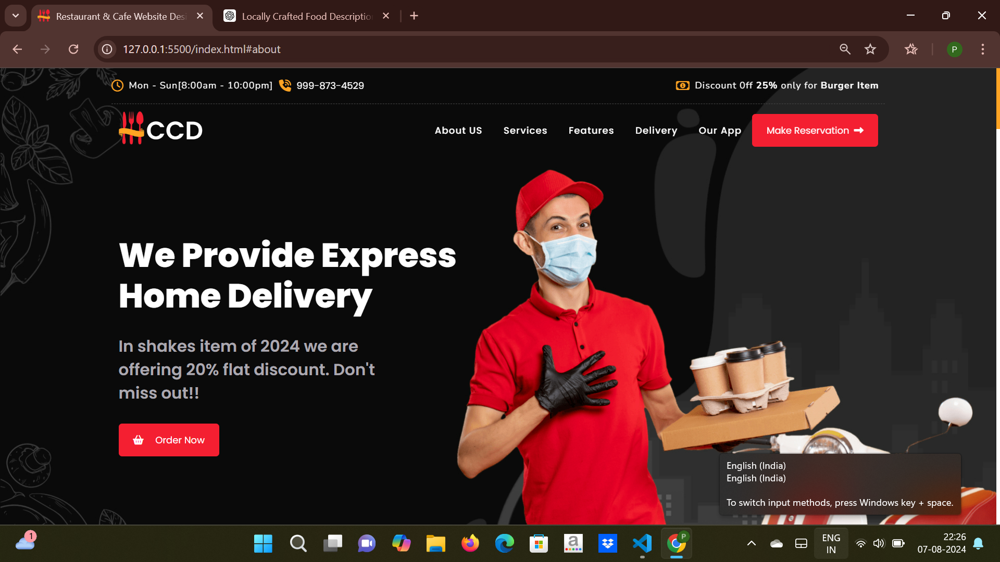
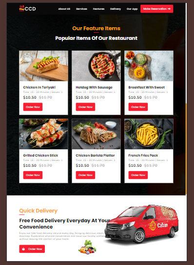
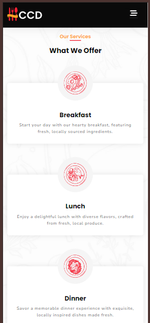
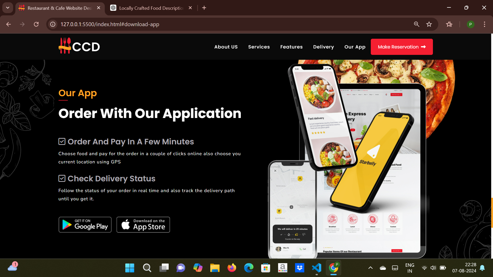

# Restaurant and Cafe Website

Welcome to the Restaurant and Cafe Website project! This project showcases a modern and responsive website design using HTML, CSS, JavaScript, and Bootstrap5, featuring sections for locally crafted food services and free delivery options.

## Table of Contents

- [Introduction](#introduction)
- [Features](#features)
- [Technologies Used](#technologies-used)
- [Setup](#setup)
- [Usage](#usage)
- [Contributing](#contributing)
- [License](#license)

## Introduction

This website design project is for a restaurant and cafe that emphasizes locally sourced ingredients and offers free food delivery services. It is built with modern web technologies to provide a seamless user experience.

## Features

- **Responsive Design:** Fully responsive layout that looks great on all devices.
- **Locally Crafted Food:** Highlighting our commitment to local produce and community support.
- **Free Food Delivery:** Convenient food delivery service available every day.
- **Modern Aesthetics:** Clean and stylish design using Bootstrap for a professional appearance.

## Technologies Used

- **HTML:** Structuring the website content.
- **CSS:** Styling the website elements.
- **JavaScript:** Adding interactivity to the website.
- **Bootstrap:** Ensuring responsive and modern design.

## Screenshots

### Homepage



### Features



### Delivery Services



### Our App



## Setup

1. **Clone the repository:**

   ```bash
   git clone https://github.com/palaksinghalaggarwal/restaurant-cafe-website.git

2. **Navigate to the project directory:**
   cd restaurant-cafe-website

3. **Open the index.html file in your browser to view the website.**

## Usage

- Browse through the different sections to explore the offerings.
- Customize the design or content as per your requirements.

## Contributing

Contributions are welcome! If you have suggestions or improvements, feel free to open an issue or submit a pull request.

## License

This project is open-source and available under the [MIT License](LICENSE).

